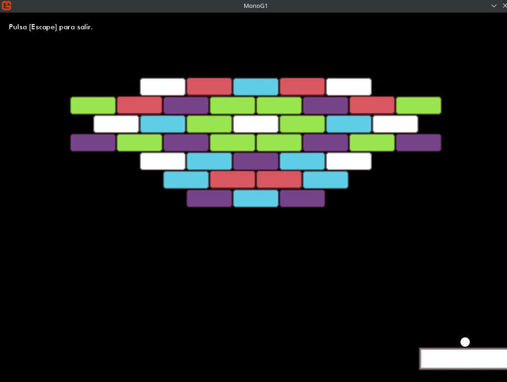

# BrickBreaker Clásico en MonoGame C#

Un remake del clásico BrickBreaker, donde el jugador controla un rectángulo en la parte inferior de la pantalla para romper bloques con una bola.

## Características

* Sprites propios con un estilo sencillo pero colorido.
* Posición de los bloques con un diseño preestablecido.
* Gestión de la bola, bloques y colisiones implementada con clases dedicadas.
* Colisiones basadas en el cálculo de círculo-línea para una detección precisa.
* Los bloques destruidos se muestran con un tono apagado.

## Tecnologías Utilizadas

* MonoGame
* C#

## Cómo Ejecutar

1.  Descarga el código fuente.
2.  Abre el proyecto con Visual Studio.
3.  Compila y ejecuta el juego.

## Controles

* La base se mueve con el ratón
* Espacio: Lanzar la bola.
* Escape: Salir al menú

## Estructura del Código

* `GestionCirculo.cs`: Gestiona el movimiento y la lógica de la bola.
* `GestionLadrillos.cs`: Controla la creación y destrucción de bloques.
* `GestionColisiones.cs`: Implementa la detección de colisiones.

## Autor

Dafnis Rey

## Posibles Mejoras 

* Poder modificar la velocidad de la bola
* Contador de bloques destruidos
* Niveles adicionales.
* Modificadores del juego al colisionar ciertos bloques
* Efectos de sonido.

